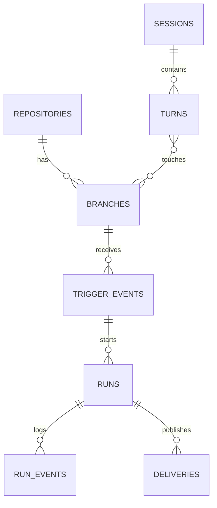

# Cloud/Local State Mirror

Date: 2026-07-02.
Status: active design note.

This note records the emerging idea that local CodeAlmanac should separate the
wiki query database from the local control/source/run database while still
mirroring the cloud product model closely enough that cloud and local share the
same concepts and engine requests.

## Decision Under Discussion

Local should have two database families:

```text
query db:
  one rebuildable index for reading/searching wiki content

control db:
  one user-level SQLite database for local control state:
  repos, branches/environments, sessions, turns, turn-to-branch touches,
  trigger events, runs, run events, and delivery metadata
```

The control DB should live under the user's CodeAlmanac home:

```text
~/.codealmanac/control.sqlite
```

Related local source/run material can live beside it:

```text
~/.codealmanac/sources/
~/.codealmanac/logs/
~/.codealmanac/cache/
```

The query DB is not the wiki source of truth. The repo's configured Almanac root
is still canonical for wiki pages, topics, and manual files. The query DB is a
rebuildable read model over those files.

The control DB stores local source-selection state and execution state. Runs and
normalized run events belong here. They do not belong in the query DB.

## Why This Helps

The cloud product has a real control plane and a hosted wiki reader index. Local
currently mixes repo-local query state with lifecycle/run state.

Separating the databases keeps the two questions clean:

```text
query db:
  "What does the current wiki say?"

control db:
  "Which local conversations touched which repo branches, and what runs happened?"
```

A local SQLite control DB gives us the same control-plane shape in both
postures:

```text
which repos are known on this machine
  -> which branches/environments are maintained
  -> which sessions/turns touched them
  -> which source bundle was selected
  -> which run happened
  -> which normalized events happened inside the run
  -> what was delivered
```

That lets cloud and local produce the same `EngineRunRequest` without pretending
that the cloud worker is a human running local CLI commands.

The query DB gives local `search`, `show`, and `serve` a fast read model without
dragging source-capture tables into the wiki index.

## Main Caution

Mirror the cloud control-plane domain model where the concept is shared. Do not
blindly copy every cloud provider table.

Cloud has GitHub App installations, Supabase users, Autumn billing, Modal call
IDs, and webhook deliveries. Local has Git remotes, local checkouts, Git hook
dispatchers, provider harness credentials, transcript files, and local Git
delivery.

The shared concepts should match. Provider-specific mechanics can have different
adapter tables.

The query DB should mirror the hosted wiki reader shape, not the cloud control
plane. It should hold pages, topics, links, file refs, source citations, and FTS
state. It should not hold conversations, runs, triggers, delivery state, or
agent logs.

## Two DBs

| DB | Owns | Rebuildable? | Main readers | Should not contain |
| --- | --- | --- | --- | --- |
| Query DB | Indexed wiki pages, topics, links, file refs, page sources, search state | Yes, from repo wiki files | `search`, `show`, `serve`, local dashboard/read UI | Captured conversations, run state, trigger policy, delivery records |
| Control DB | Repos, branches/environments, sessions, turns, turn-to-branch touches, trigger events, runs, run events, deliveries | Partly; source/run history is durable local state | `setup`, `capture`, hooks, workers, jobs/runs UI | Accounts, billing, page bodies, page graph |

This is the local parallel to cloud:

```text
cloud hosted wiki reader DB  <->  local query DB
cloud control/source/run DB  <->  local control DB
```

## State Chart

| Product concept | Cloud DB shape | Local SQLite shape | Notes |
| --- | --- | --- | --- |
| User | Cloud DB: `users` from app auth/GitHub OAuth | No local table in v1 | Local is one human on one machine. A generated local actor is unnecessary unless a feature needs it. |
| Account/org | Cloud DB: `accounts` for GitHub user/org owners | No local table in v1 | Store `owner_login`, `owner_type`, and provider IDs on `repositories` instead. |
| Membership | Cloud resolves live from GitHub | No local table in v1 | Local has no account-level permission gate. |
| Installation/connection | Cloud DB: `installations` for GitHub App installation | No local table in v1 | Local Git/GitHub access can be inferred from remotes and local credentials. |
| Repository | Cloud DB: `repositories` keyed by GitHub repo id | Control DB: `repositories` | Local repo rows can include path, remote URL, provider repo ID, owner login, repo name, and default branch. |
| Branch/environment | Cloud source model needs branch/environment rows | Control DB: `branches` or `environments` | A branch belongs to one repo. This is the local equivalent of branch-backed cloud environments. |
| Session | Cloud-captured Codex/Claude session | Control DB plus source files: local-discovered or local-captured Codex/Claude session | Store full-session source reference, not only selected turns. |
| Turn | Captured provider turn | Control DB: local parsed provider turn | Used for branch/environment attribution. |
| Turn touch | `turn_branch` / `turn_environment` many-to-many | Control DB: same join table | This join table is still needed even in the minimal schema. |
| Source bundle | Built from selected sessions for one run | Can be materialized from repo/branch/session/turn tables | It does not require its own table in v1. |
| Run | Cloud DB: `runs` | Control DB: `runs` | Local and cloud should use the same table name for the same concept. |
| Run events | Cloud should add `run_events` | Control DB: `run_events` | Local already has normalized JSONL run events; cloud should store equivalent normalized events for hosted Codex/Claude runs. |
| Delivery | Cloud DB plus GitHub: commit or PR | Control DB plus local Git: commit to branch | Same delivery concept, different publisher. |
| Wiki index | Hosted wiki reader DB over Git branch/PR/default refs | Query DB over local checkout/ref | Rebuildable cache, not source of truth. |
| Billing | Autumn/account-level | none | Do not create local billing tables. Local has no billing gate. |
| Webhook delivery | Cloud DB: `webhook_deliveries` | none | Local does not receive GitHub webhooks in the local-only path. |

## Proposed Local Tables

This is the first local control DB table family to discuss:

```text
repositories
branches
sessions
turns
turn_branches
trigger_events
runs
run_events
deliveries
```

`turn_branches` is a join table, not a new product entity, but it is required
because one turn can touch multiple branches and one branch can be touched by
many turns.

This keeps the local model parallel where the concepts are actually shared:
source selection, triggers, runs, run events, and delivery. It does not force
local to pretend it has GitHub App installations, Supabase auth rows, accounts,
billing, or team permission state.

The query DB table family should stay close to the current local/hosted reader
model:

```text
wiki_pages
wiki_topics
wiki_page_topics
wiki_topic_parents
wiki_file_refs
wiki_page_sources
wiki_wikilinks
fts/search tables
```

Cross-wiki links are sunset. Future local and cloud query DBs should not add new
cross-wiki-link behavior.

## ER Chart



This ER chart is for the control DB. The query DB has a separate page/topic/link
graph and can be rebuilt from the wiki files.

## Setup Consequence

Local setup writes the control DB:

```bash
codealmanac local setup  # records the current repo and branches
```

Cloud setup may have its own auth/cache state, but the local control DB does not
need to model accounts to support local triggers, runs, or source selection.

The query DB is created or refreshed when a user reads a wiki:

```bash
codealmanac search "auth"
codealmanac show auth-flow
codealmanac serve
```

Those read commands should not need to know about conversation capture or run
history.

## Account Decision

Do not add `accounts` to the local control DB in v1.

```text
cloud:
  account is load-bearing for billing, GitHub App installation, repo ownership,
  permissions, account dashboards, and organization membership.

local:
  account is mostly the owner prefix in `owner/repo`.
```

For local, denormalize account-ish fields onto `repositories`:

```text
repositories
  id
  provider              # github, local
  provider_repo_id       # nullable
  owner_login            # nullable for non-GitHub local repos
  owner_type             # user, organization, unknown
  name
  full_name              # owner/name when known
  root_path
  remote_url
  default_branch
```

Add `accounts` later only if local gets an account-level feature: per-account
settings, multiple GitHub credentials, account-level capture consent, local
billing/entitlement display, or cloud sync reconciliation that cannot be handled
from denormalized repo owner fields.

## Checkout Decision

For the minimal v1, the `repositories` row can represent the local checkout.
That means `root_path` lives directly on `repositories`.

If users commonly have multiple checkouts of the same logical repo, split later:

```text
repositories
repository_checkouts
```

That split is cleaner, but it is not required for the first local
source-attribution DB if the product treats each local checkout as one local
repo row.

## Open Questions

- Should local copy full conversation files into `~/.codealmanac/sources/`, or
  store references until a run selects them?
- Should query DBs live per checkout, per logical repo, or in
  `~/.codealmanac/query/` keyed by checkout/ref?
- Should cloud and local share an actual schema package, or share Pydantic/domain
  models while each adapter owns its migrations?
- What is the migration path from current repo-local `jobs/*.json` and
  `jobs/*.jsonl` files into the future user-level `runs` and `run_events`
  control DB tables?

## Current Recommendation

Use two local SQLite DB responsibilities:

```text
query DB:
  rebuildable read model over the repo wiki

control DB:
  durable local trigger/source/run/delivery metadata under ~/.codealmanac/
```

Make the local control DB conceptually parallel to cloud only where local needs
the concept:

```text
repos -> branches -> sessions -> turns -> trigger_events -> runs -> run_events -> deliveries
```

with the required many-to-many join:

```text
turns <-> branches
```

Do not make it a byte-for-byte clone of the cloud schema. The shared layer should
be typed domain models and engine requests. Cloud and local migrations can differ
where provider mechanics differ.
