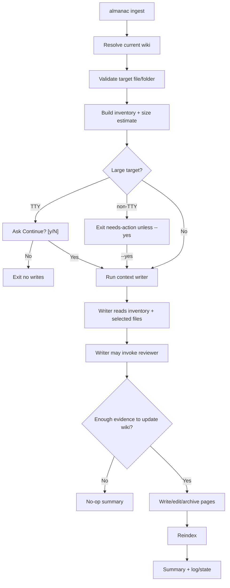

# Manual Ingest Command Implementation Plan

> **For Claude:** REQUIRED SUB-SKILL: Use superpowers:executing-plans to implement this plan task-by-task.

**Goal:** Add `almanac ingest <file-or-folder>` for manual context ingestion while keeping `capture` as the automatic session updater and moving first-time whole-codebase setup toward `almanac init`.

**Architecture:** Keep the three user intents separate at the CLI boundary: `init` creates the first wiki from the whole repo, `capture` updates from AI session transcripts, and `ingest` updates from user-supplied files or folders. Reuse the existing provider selection, agent runner, streaming formatter, reviewer wiring, page snapshot diffing, and post-run reindex behavior instead of creating another agent pipeline.

**Tech Stack:** TypeScript, Commander, local filesystem inventory, existing provider abstraction in `src/agent/`, bundled markdown prompts, Vitest.

---

## Product Model

### Commands

```bash
almanac init
```

First-time whole-codebase wiki creation. This is the current `bootstrap` behavior under the clearer product name: scaffold `.almanac/`, run the broad repo scan, seed pages/topic DAG, then reindex.

```bash
almanac capture
almanac capture --session <id>
almanac capture <transcript-path>
```

Automatic or explicit session capture. This remains the hook target and continues to digest AI coding sessions into wiki updates. It should never ask interactive questions because it runs in the background.

```bash
almanac ingest <file-or-folder>
```

Manual context ingest. The user points at an existing note, doc, source file, or folder and asks codealmanac to extract information that will help future work. This is not a transcript capture and not a full repo bootstrap.

### Why Not Collapse Everything Into `ingest`

The commands should map to user intent, not shared implementation:

- `init` means "create the first almanac for this repo."
- `capture` means "capture what just happened in an AI coding session."
- `ingest` means "digest this context I am pointing at."

Internally, all three can share an agent harness. Externally, three verbs keep the mental model clean.

### Language Rule

Avoid abstract phrasing like "durable knowledge" in user-facing output. Use:

> "information that will help future coding sessions"

or:

> "useful context for future work"

The prompt may still explain the notability bar in detail, but CLI warnings and summaries should stay plain.

## Large Context Policy

Manual folder ingest can be expensive. The product should warn about time and token usage, not about quality.

Bad warning:

```text
This may produce weak results unless narrowed.
```

Good warning:

```text
almanac: this target is large: 1,240 files / 38 MB.
This may take longer and use more tokens.
Continue? [y/N]
```

Rules:

- For TTY/manual runs, ask `Continue? [y/N]` when a target exceeds the default size threshold.
- For non-TTY/scripted runs, do not block. Exit with a `needs-action` outcome and tell the user to rerun with `--yes`.
- `--yes` confirms large manual ingest explicitly.
- `capture` must never ask; it should remain background-safe.
- Budget exhaustion must result in no page writes plus a clear summary, not partial pages.
- The writer prompt must say: if the selected context is too broad or insufficiently understood, write nothing and explain what smaller context would help.

## Ingest Flow



## Task 1: Reframe First-Time Setup As `init`

**Files:**
- Modify: `src/cli/register-wiki-lifecycle-commands.ts`
- Modify: `src/commands/bootstrap.ts`
- Modify: `src/commands/setup/next-steps.ts`
- Modify: `src/commands/list.ts`
- Modify: `src/commands/doctor-checks/wiki.ts`
- Modify: `README.md`
- Modify: `docs/concepts.md`
- Tests: existing bootstrap/init/setup/list/doctor tests

**Step 1: Add `almanac init` as the canonical first-ingest command**

Register an `init` command that calls the current `runBootstrap` implementation with the same options:

```bash
almanac init
almanac init --quiet
almanac init --agent codex
almanac init --model gpt-5.3-codex
almanac init --force
almanac init --json
```

Expected behavior: same as current `bootstrap`, including auto-scaffolding `.almanac/` and refusing populated wikis unless `--force`.

**Step 2: Keep `bootstrap` as a deprecated alias**

Do not remove `bootstrap` in the same slice. Make it call the same implementation and print one deprecation warning:

```text
almanac: `almanac bootstrap` is deprecated; use `almanac init`
```

This matches the existing command-deprecation style in `docs/plans/2026-05-07-command-deprecations.md`.

**Step 3: Rename user-facing wording**

Update help, diagnostics, README, concepts, setup next steps, and doctor fixes from "bootstrap" to "init" where this is the canonical recommendation.

Examples:

```text
run: almanac init
```

```text
init      create the first wiki from a whole-codebase AI scan
capture   update the wiki from the latest AI coding session
ingest    update the wiki from a specified file or folder of context
```

**Step 4: Tests**

Add or update tests proving:

- `almanac init` invokes the same path as current `bootstrap`.
- `almanac bootstrap` still works and emits the deprecation warning.
- Setup/doctor/list hints recommend `almanac init`, not `almanac bootstrap`.

Run:

```bash
npm test -- test/bootstrap.test.ts test/setup.test.ts test/list.test.ts test/doctor.test.ts
```

Expected: all selected tests pass.

**Step 5: Commit**

```bash
git add src/cli/register-wiki-lifecycle-commands.ts src/commands/bootstrap.ts src/commands/setup/next-steps.ts src/commands/list.ts src/commands/doctor-checks/wiki.ts README.md docs/concepts.md test
git commit -m "feat(cli): make init the first wiki ingest command"
```

## Task 2: Add Manual Ingest Prompt

**Files:**
- Create: `prompts/ingest.md`
- Modify: `src/agent/prompts.ts`
- Test: prompt-loading tests, if present; otherwise add focused coverage near existing prompt tests

**Step 1: Create `prompts/ingest.md`**

The prompt should share the writer's standards but change the source of context:

```markdown
# Manual Ingest Prompt

You are the codealmanac manual ingest writer. The user pointed codealmanac at a file or folder of context. Your job is to update the repo's `.almanac/` wiki only when that context contains information that will help future coding sessions.

## What you're reading

- The repo's `.almanac/README.md` and notability bar
- Existing wiki pages via `almanac search` and `almanac show`
- The target inventory passed in the prompt
- Selected target files that you choose to read
- Source files needed to verify claims

## Critical rule

Do not summarize the target. Treat it as evidence. Write or update pages only when the context teaches something future agents should know: decisions, gotchas, invariants, cross-file flows, incidents, repo-specific practices, or domain concepts.

If the target is too broad, too noisy, or cannot be understood within the available context, write nothing. Explain what narrower path or file would help.

## Large targets

Read selectively. Start from the inventory. Prefer existing pages and files already referenced by the wiki. Do not try to read every file in a folder. Never write a partial page because you ran out of budget.
```

The full prompt should also include:

- prefer updating over creating
- reviewer invocation rules
- archive vs edit
- no generic advice
- no speculative rationale
- direct writing into `.almanac/pages/`

**Step 2: Teach prompt loader about `ingest`**

Update `PromptName` and `PROMPT_NAMES`:

```typescript
export type PromptName = "bootstrap" | "writer" | "reviewer" | "ingest";
```

Ensure the prompt directory validation requires `ingest.md`.

**Step 3: Tests**

Run:

```bash
npm test -- test/auth.test.ts test/bootstrap.test.ts test/capture.test.ts
```

Expected: existing prompt resolution still passes, and the new ingest prompt is included in packaged prompt lookup.

**Step 4: Commit**

```bash
git add prompts/ingest.md src/agent/prompts.ts test
git commit -m "feat(ingest): add manual context writer prompt"
```

## Task 3: Build Target Inventory

**Files:**
- Create: `src/commands/ingest/inventory.ts`
- Create: `src/commands/ingest/types.ts`
- Test: `test/ingest-inventory.test.ts`

**Step 1: Define inventory types**

```typescript
export interface IngestInventoryEntry {
  path: string;
  kind: "file" | "dir";
  bytes: number;
  extension: string | null;
}

export interface IngestInventory {
  targetPath: string;
  targetKind: "file" | "folder";
  totalFiles: number;
  totalBytes: number;
  entries: IngestInventoryEntry[];
  skipped: Array<{ path: string; reason: string }>;
}
```

**Step 2: Implement inventory rules**

For a file target:

- require an existing file
- record path relative to repo root when possible
- include byte size

For a folder target:

- recursively walk files
- skip hidden/generated/vendor/build directories:
  - `.git`
  - `.almanac`
  - `node_modules`
  - `dist`
  - `build`
  - `coverage`
  - `.next`
  - `.turbo`
  - `.venv`
  - `vendor`
- skip binaries by extension and/or failed UTF-8 sniffing
- skip very large individual files from the default inventory, but record them in `skipped`
- sort entries deterministically by path

Do not read full file contents in the inventory phase except for tiny sniffing. The inventory is a map, not the ingest context itself.

**Step 3: Tests**

Cover:

- single file target
- nested folder target
- generated/vendor skips
- `.almanac/` skip
- deterministic ordering
- total file/byte counts
- missing target error

Run:

```bash
npm test -- test/ingest-inventory.test.ts
```

Expected: all tests pass.

**Step 4: Commit**

```bash
git add src/commands/ingest test/ingest-inventory.test.ts
git commit -m "feat(ingest): inventory manual context targets"
```

## Task 4: Add Large Target Confirmation

**Files:**
- Create: `src/commands/ingest/limits.ts`
- Create: `src/commands/ingest/confirm.ts`
- Test: `test/ingest-confirm.test.ts`

**Step 1: Define limits**

Start conservative:

```typescript
export const DEFAULT_INGEST_LIMITS = {
  maxFilesBeforeConfirm: 100,
  maxBytesBeforeConfirm: 2 * 1024 * 1024,
};
```

These are confirmation thresholds, not hard quality limits.

**Step 2: Implement confirmation behavior**

Inputs:

```typescript
interface ConfirmLargeIngestOptions {
  inventory: IngestInventory;
  yes?: boolean;
  stdin: NodeJS.ReadStream;
  stdout: NodeJS.WriteStream;
}
```

Behavior:

- if below threshold, continue
- if `--yes`, continue
- if `stdin.isTTY && stdout.isTTY`, print warning and read one line
- accept only `y` or `yes` case-insensitively
- default is no
- if not TTY, return a `needs-action` result telling the user to pass `--yes`

Warning copy:

```text
almanac: this target is large: 1,240 files / 38 MB.
This may take longer and use more tokens.
Continue? [y/N]
```

Do not mention weak results.

**Step 3: Tests**

Cover:

- below threshold continues without prompt
- `--yes` continues without prompt
- TTY `y` continues
- TTY blank/no exits
- non-TTY exits with needs-action
- warning mentions time/tokens only

Run:

```bash
npm test -- test/ingest-confirm.test.ts
```

Expected: all tests pass.

**Step 4: Commit**

```bash
git add src/commands/ingest/limits.ts src/commands/ingest/confirm.ts test/ingest-confirm.test.ts
git commit -m "feat(ingest): confirm large manual targets"
```

## Task 5: Implement `almanac ingest <file-or-folder>`

**Files:**
- Create: `src/commands/ingest.ts`
- Modify: `src/cli/register-wiki-lifecycle-commands.ts`
- Modify: `src/commands/init.ts`
- Modify: `package.json` if needed for package files
- Test: `test/ingest.test.ts`

**Step 1: Command surface**

```bash
almanac ingest <target>
almanac ingest <target> --quiet
almanac ingest <target> --agent <agent>
almanac ingest <target> --model <model>
almanac ingest <target> --json
almanac ingest <target> --yes
```

No default no-arg behavior. `almanac ingest` without a target should error:

```text
almanac: ingest requires a file or folder path
```

This avoids ambiguity with `capture`, which already owns "latest session."

**Step 2: Resolve wiki**

Manual ingest requires an existing wiki. If no `.almanac/` is found:

```text
almanac: no .almanac/ found in this directory or any parent.
run: almanac init
```

Do not auto-init from `ingest`; `init` is the intentional first setup.

**Step 3: Reuse capture harness pieces**

The new command should mirror `runCapture` where useful:

- provider selection via `resolveAgentSelection`
- auth via `assertAgentAuth`
- page snapshot before/after
- reviewer subagent definition
- `StreamingFormatter`
- log file under `.almanac/logs/.ingest-<timestamp>.jsonl`
- structured `CommandOutcome`
- summary with created/updated/archived counts

If duplication grows, extract a shared helper in a follow-up task:

```text
src/commands/agent-runner.ts
```

Do not build a proposal/apply state machine.

**Step 4: Build user prompt**

Pass the agent:

```text
Manual ingest this context.
Target: <absolute path>.
Working directory: <repoRoot>.

Inventory:
<deterministic summarized inventory>
```

For large inventories, include a bounded list of entries plus aggregate counts and skipped reasons. The agent can use `Read`, `Glob`, and `Grep` to selectively inspect files.

**Step 5: Run agent**

Use tools:

```typescript
const INGEST_TOOLS = ["Read", "Write", "Edit", "Glob", "Grep", "Bash", "Agent"];
```

Use reviewer tools identical to capture:

```typescript
const REVIEWER_TOOLS = ["Read", "Grep", "Glob", "Bash"];
```

Max turns should start lower than capture unless explicit product testing says otherwise:

```typescript
maxTurns: 120
```

**Step 6: Reindex after writes**

If the page delta shows any created, updated, or archived pages, call `runIndexer({ repoRoot })` before returning. This keeps the next query fast while preserving read-side freshness for manual edits, pulls, merges, and branch switches.

**Step 7: Tests**

Use fake `runAgent` injection like capture tests.

Cover:

- missing wiki returns needs-action with `almanac init`
- missing target errors
- file target passes inventory to prompt
- folder target passes inventory to prompt
- large non-TTY target requires `--yes`
- large target with `--yes` proceeds
- no-op agent result returns noop
- created/updated/archived summary works
- log file is written
- JSON output shape works

Run:

```bash
npm test -- test/ingest.test.ts
```

Expected: all tests pass.

**Step 8: Commit**

```bash
git add src/commands/ingest.ts src/commands/ingest src/cli/register-wiki-lifecycle-commands.ts test/ingest.test.ts
git commit -m "feat(ingest): add manual context ingestion"
```

## Task 6: Documentation And Help

**Files:**
- Modify: `README.md`
- Modify: `docs/concepts.md`
- Modify: `guides/mini.md`
- Modify: `guides/reference.md`
- Modify: CLI help tests if present

**Step 1: Update command docs**

Document the final command split:

```text
init      create the first wiki from a whole-codebase scan
capture   update the wiki from AI coding sessions, usually automatically
ingest    update the wiki from a specified file or folder of context
```

Examples:

```bash
almanac init
almanac capture status
almanac ingest docs/payment-outage.md
almanac ingest docs/old-system/
```

**Step 2: Explain large target confirmation**

Add a short section:

```text
For large folders, ingest asks before starting because the run may take longer and use more tokens. In scripts, pass --yes to confirm explicitly.
```

**Step 3: Clarify that ingest is not folder summarization**

Plain-language docs:

```text
`ingest` treats the target as context. It does not create a page for every file or summarize a folder. It updates the wiki only when the context contains information that will help future coding sessions.
```

**Step 4: Tests**

Run:

```bash
npm test -- test/cli.test.ts test/setup.test.ts
```

Expected: command help and setup next steps match the new terminology.

**Step 5: Commit**

```bash
git add README.md docs/concepts.md guides/mini.md guides/reference.md test
git commit -m "docs: explain init capture and ingest workflows"
```

## Task 7: Final Verification

**Files:**
- No new files; verification only

**Step 1: Run full tests**

```bash
npm test
```

Expected: all Vitest suites pass.

**Step 2: Run typecheck**

```bash
npm run lint
```

Expected: TypeScript exits 0.

**Step 3: Build**

```bash
npm run build
```

Expected: tsup exits 0 and emits `dist/`.

**Step 4: Manual smoke test**

In a temporary repo:

```bash
almanac init --quiet
almanac ingest README.md --quiet
almanac capture status
almanac search --json
```

Expected:

- `init` creates `.almanac/`
- `ingest` either updates pages or returns a no-op without error
- `capture status` still works
- `search` works after any ingest writes

**Step 5: Final commit or PR**

If all tasks were committed individually, no final squash is required. If implementation happened in one branch and the team prefers one slice commit, squash into:

```bash
git commit -m "feat(ingest): add manual context ingestion"
```

## Open Questions For Implementation

- Should `bootstrap` remain visible in root help as deprecated, or hidden after one release?
- Should `ingest` support `--wiki <name>` immediately, or only current-repo lookup in v1?
- Should confirmation thresholds be configurable in `~/.almanac/config.toml`, or fixed until real usage data says otherwise?
- Should ingest state records mirror capture status in a future `almanac ingest status`, or are logs enough for v1?

