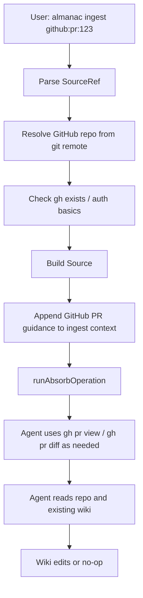

# Local GitHub Source Ingest Implementation Plan

> **For Claude:** REQUIRED SUB-SKILL: Use superpowers:executing-plans to implement this plan task-by-task.

**Goal:** Add local `almanac ingest github:pr:<number>` support so Absorb can use a GitHub pull request as bounded starting context for wiki updates.

**Architecture:** Keep the existing Absorb operation as the wiki-writing engine. Add a small source-ref layer that parses `github:pr:123`, resolves the current GitHub repo from local git remotes, checks that the GitHub CLI is available, and appends source-specific guidance to the Absorb command context. The agent uses `gh` during the run; TypeScript does not prefetch, summarize, or decide PR relevance.

**Naming (settled in design discussion):**
- `SourceRef` = parsed user input (`github:pr:123` → `{ provider, kind, id }`).
- `Source` = resolved, ready-for-Absorb fact bundle (`{ kind, repo, url, number }`).
- The resolver returns structured facts only. Prompt rendering stays in `ingestContext()` in `src/commands/operations.ts`, alongside how path ingest is rendered today.
- No `provenanceHint` wrapper. PR identity lives directly on `Source` (`url`, `number`).

**Tech Stack:** TypeScript, Commander, existing `runIngestCommand()` / `runAbsorbOperation()` flow, shell command checks for `git` and `gh`, Vitest.

---

## Context And Decisions

This plan comes from a design discussion about making external project work ingestible by Almanac. The immediate product goal is small: let local users run:

```bash
almanac ingest github:pr:123
```

and have Absorb inspect that GitHub pull request with normal agent judgment, then update the wiki only if durable project memory changed.

The current implementation has two relevant behaviors:

- `almanac ingest <paths...>` passes file/folder paths into Absorb as command context.
- Absorb receives prompts, runtime context, source-control guidance, command context, and normal repo tools. It does not have a structured source layer today.

The implementation should extend `ingest` rather than add a public `absorb` command. `Absorb` remains the internal operation; `ingest` is the user-facing command for bounded external input.

## What We Considered And Rejected For V1

### Hosted GitHub App

Rejected for this slice. A GitHub App is likely the right hosted product later, but it requires webhooks, installation tokens, hosted workers, queues, repo checkout/sandboxing, PR/comment publishing, billing, and deployment. Those concerns would delay validating the core question: does PR context improve Almanac wiki maintenance?

### Composio As The GitHub Access Path

Rejected for local GitHub v1. Composio is useful for future broad connectors such as Linear, Slack, Notion, Gmail, or hosted product flows, but GitHub is special locally because many developers already have `gh auth login`. Requiring a Composio account/API key/auth config for `github:pr:123` would make the first local experience heavier and add cost or trust questions.

### Almanac-Managed Composio For Local OSS

Rejected for v1. If Almanac owns the Composio project and users connect through it, Almanac pays for connector calls and owns the external-service trust boundary. That may be correct for a paid hosted product, not for the local OSS path.

### User-Brings-Composio-Key For GitHub

Rejected as the default. It can remain a future advanced connector mode, but the default local GitHub path should not require users to understand Composio setup.

### Prefetch And Materialize PR Data Before Absorb

Rejected for v1. The earlier Notion connector branch used Composio to prefetch Notion pages into normalized run-local source bundles, then passed those artifacts to Absorb. That is appropriate for document-like sources, but for GitHub PRs it risks creating a TypeScript mini-ingestion pipeline:

- TypeScript chooses fields.
- TypeScript renders markdown.
- TypeScript truncates comments/diffs.
- The agent reads a curated packet.

This conflicts with the project preference that intelligence lives in prompts and agent tool use, not deterministic preprocessing. For v1, TypeScript should do cheap operational setup only; the agent should run `gh` commands itself.

### Live Composio Tool Runtime

Rejected for this slice. The concept is useful later, especially for non-GitHub connectors, but it is not needed to prove local GitHub PR ingest.

### Dedupe Keys

Rejected for v1. A stable key such as `github:owner/repo:pr:123` will matter for hosted webhooks, queue dedupe, and duplicate local runs. For this slice, do not add dedupe semantics or run-record schema changes. Keep the model simple.

### Issue Ingest

Deferred unless the implementation naturally supports it with little extra complexity. The first implementation should support `github:pr:<number>` only. `github:issue:<number>` can follow after the PR path is reviewed.

## Current Convergence

Use a minimal source-ref model:

```text
SourceRef -> Source -> ingestContext() -> Absorb
```

`SourceRef` is syntax: what the user typed.

`Source` is resolved fact data: what `ingestContext()` needs to render the Absorb command context.

The GitHub-specific code should not wrap the GitHub API. It should only:

- parse `github:pr:123`
- infer `owner/repo` from the local git remote
- check `gh` is available, with a clear setup message when missing
- build source-specific prompt context for Absorb

The agent then uses `gh` through the existing shell tool during the Absorb run.

## User Experience

Happy path:

```bash
almanac ingest github:pr:123
```

Output remains consistent with existing background ingest behavior:

```text
ingest started: run_...
```

Foreground remains supported:

```bash
almanac ingest github:pr:123 --foreground
```

If GitHub CLI is missing, print a clear needs-action message:

```text
GitHub ingest needs the GitHub CLI (`gh`).

Install and authenticate it:

  1. Install GitHub CLI:
     https://cli.github.com/

  2. Sign in:
     gh auth login

  3. Try again:
     almanac ingest github:pr:123
```

If `gh` exists but auth is missing:

```text
GitHub CLI is installed, but not authenticated.

Sign in with:

  gh auth login

Then try again:

  almanac ingest github:pr:123
```

If the current repo does not have a GitHub remote:

```text
GitHub source ingest requires a GitHub remote for this repository.

Set an origin remote that points to GitHub, or run this command from a GitHub-backed repo:

  git remote -v
```

## Data Flow



## Types

Keep v1 types narrow.

```typescript
export type SourceRef =
  | {
      raw: string;
      provider: "github";
      kind: "pr";
      id: string;
    };

export interface Source {
  kind: "github.pr";
  raw: string;
  repo: string;
  url: string;
  number: string;
}
```

Responsibilities:

```text
SourceRef
  parses user input
  no repo lookup
  no prompt guidance
  no GitHub auth
  no shell commands

GitHub source resolver
  takes SourceRef
  detects owner/repo
  checks gh availability/auth
  builds Source

Source
  carries resolved facts (kind, repo, url, number) into operations.ts
  does not carry a pre-rendered prompt string
  does not fetch PR content
  does not decide notability
  does not edit wiki

ingestContext() (operations.ts)
  receives Source[] (or path[])
  renders the command-context block including GitHub PR guidance
  remains the single prompt-rendering site for ingest

Absorb
  reads the rendered context
  runs gh commands if useful
  reads code/wiki
  decides whether to update wiki
```

## Absorb Prompt Context

For `almanac ingest github:pr:123`, append a section like:

```text
Command context:
- Command: ingest
- Input source: github:pr:123
- Source kind: GitHub pull request
- Repository: owner/repo
- URL: https://github.com/owner/repo/pull/123

GitHub PR ingest guidance:
Use the GitHub CLI (`gh`) to inspect this PR as needed.

Suggested commands:
- gh pr view 123 --repo owner/repo --json title,body,url,author,baseRefName,headRefName,mergedAt,files,reviews,comments,closingIssuesReferences
- gh pr diff 123 --repo owner/repo

Treat PR discussion as evidence, not final truth.
Prefer current code and the merged diff for present-tense behavior.
Update the Almanac only if this PR contains durable project memory.
If this PR supports a wiki claim, cite it with a `sources:` entry of `type: pr`.
No-op if the PR does not improve durable project memory.
```

The suggested commands are guidance, not a rigid pipeline. The agent may use other `gh` or repository commands if useful.

## Task 1: Parse Source Refs

**Files:**

- Create: `src/ingest/source-ref.ts`
- Test: `test/source-ref.test.ts`

**Step 1: Write failing parser tests**

Cover:

- `github:pr:123` parses.
- `github:pr:` fails.
- `github:pr:abc` fails.
- `github:issue:123` fails for v1 with an unsupported-kind error.
- `docs/foo.md` is not treated as a source ref.

Expected parser behavior:

```typescript
parseSourceRef("github:pr:123")
// { ok: true, value: { raw: "github:pr:123", provider: "github", kind: "pr", id: "123" } }

parseSourceRef("docs/foo.md")
// { ok: false, reason: "not-source-ref" }
```

**Step 2: Implement minimal parser**

Keep it independent from CLI code. Do not import Commander or operations.

**Step 3: Run tests**

```bash
npm test -- test/source-ref.test.ts
```

Expected: parser tests pass.

**Step 4: Commit**

```bash
git add src/ingest/source-ref.ts test/source-ref.test.ts
git commit -m "feat(ingest): parse source refs"
```

## Task 2: Add GitHub Source Resolver

**Files:**

- Create: `src/ingest/github.ts`
- Test: `test/github-source-resolver.test.ts`

**Step 1: Write failing tests for remote parsing**

Cover these remotes:

```text
https://github.com/owner/repo.git
https://github.com/owner/repo
git@github.com:owner/repo.git
ssh://git@github.com/owner/repo.git
```

Reject:

```text
https://gitlab.com/owner/repo.git
not-a-url
```

**Step 2: Write failing tests for setup checks**

Use injected command runner. Do not execute real `git` or `gh` in tests.

Cover:

- `gh` missing returns the multi-step setup message.
- `gh auth status` failure returns the auth message.
- non-GitHub remote returns the GitHub remote message.

**Step 3: Implement resolver**

Expose a function like:

```typescript
export async function resolveGitHubSource(args: {
  ref: Extract<SourceRef, { provider: "github" }>;
  cwd: string;
  runCommand?: CommandRunner;
}): Promise<Source>;
```

The resolver should:

1. run `git remote get-url origin`
2. parse owner/repo
3. run `gh --version`
4. run `gh auth status`
5. return a `Source` (structured facts only — no rendered prompt)

Do not run `gh pr view` or `gh pr diff` in resolver.

**Step 4: Run tests**

```bash
npm test -- test/github-source-resolver.test.ts
```

Expected: resolver tests pass.

**Step 5: Commit**

```bash
git add src/ingest/github.ts test/github-source-resolver.test.ts
git commit -m "feat(ingest): resolve GitHub PR sources"
```

## Task 3: Integrate Sources Into `ingest`

**Files:**

- Modify: `src/commands/operations.ts`
- Test: `test/operation-commands.test.ts`

**Step 1: Write failing command tests**

Add tests that use injected dependencies to avoid real `git`, `gh`, and provider runs.

Cover:

- `runIngestCommand({ paths: ["github:pr:123"] })` calls `runAbsorbOperation` with `targetKind: "source"`.
- The generated context (rendered by `ingestContext()`) includes:
  - `Input source: github:pr:123`
  - `Source kind: GitHub pull request`
  - `Repository: owner/repo`
  - suggested `gh pr view`
  - `sources:` / `type: pr` citation guidance
- normal path ingest still uses `targetKind: "path"` and existing path context.

If the current command dependency injection is not sufficient, introduce only the smallest injectable resolver seam needed for tests.

**Step 2: Implement source-aware ingest resolution**

In `runIngestCommand`:

1. partition inputs into source refs and paths
2. for v1, allow either all paths or all source refs
3. reject mixed path/source input for now with a clear message
4. resolve GitHub source refs into `Source[]`
5. call `runAbsorbOperation` with `targetKind: "source"` and prompt context rendered by `ingestContext({ sources })`

Mixed inputs can be supported later. Rejecting them keeps v1 simpler and avoids vague prompt context.

**Step 3: Preserve current path behavior**

Existing `almanac ingest docs/foo.md` behavior must not change.

**Step 4: Run focused tests**

```bash
npm test -- test/operation-commands.test.ts
```

Expected: all operation command tests pass.

**Step 5: Commit**

```bash
git add src/commands/operations.ts test/operation-commands.test.ts
git commit -m "feat(ingest): run Absorb from GitHub PR sources"
```

## Task 4: Update CLI Help Text

**Files:**

- Modify: `src/cli/register-wiki-lifecycle-commands.ts`
- Test: existing CLI/help tests if present

**Step 1: Update description**

Change:

```text
absorb knowledge from one or more files or folders
```

to:

```text
absorb knowledge from files, folders, or source addresses
```

**Step 2: Add examples only if this repo has an existing examples/help pattern**

Do not introduce a new help system for this slice.

**Step 3: Run CLI tests**

```bash
npm test -- test/cli.test.ts
```

Expected: CLI tests pass.

**Step 4: Commit**

```bash
git add src/cli/register-wiki-lifecycle-commands.ts test/cli.test.ts
git commit -m "docs(cli): describe source-address ingest"
```

## Task 5: Full Verification

**Files:**

- No planned source edits.

**Step 1: Typecheck**

```bash
npm run typecheck
```

If this repo does not have `typecheck`, use:

```bash
npx tsc --noEmit
```

Expected: pass.

**Step 2: Full test suite**

```bash
npm test
```

Expected: pass.

**Step 3: Manual smoke test when `gh` is available**

From this repo:

```bash
almanac ingest github:pr:1 --foreground
```

Use a harmless public PR if `#1` is not appropriate. If running a real foreground Absorb would spend model tokens, skip this and instead test the command path with a mocked provider or `--json` background start in a temporary test repo.

**Step 4: Inspect run context**

If a background run is started, inspect:

```bash
almanac jobs show <run-id>
almanac jobs logs <run-id>
```

Confirm the prompt context contains GitHub source guidance and no secrets.

**Step 5: Final commit**

```bash
git status --short
git log --oneline -5
```

Do not squash until review is complete.

## Documentation / Wiki Updates

After implementation, update the wiki if the design lands:

- `ingest-operation`
- `source-provenance`
- possibly `github-native-wiki-maintenance`

The durable wiki update should say:

- local GitHub ingest is source-ref based
- it uses `gh` in v1
- it does not prefetch PRs before Absorb
- `SourceRef` is syntax, `Source` is resolved facts, and `ingestContext()` renders Absorb context
- hosted GitHub App and Composio connectors are separate future layers

## Review Checklist

Ask reviewers to focus on:

- whether `SourceRef` / `Source` names are clear
- whether `gh` checks are too strict or too loose
- whether `runIngestCommand` stays clean and does not become connector-specific over time
- whether mixed source/path input should be rejected or supported in v1
- whether prompt guidance gives the agent enough agency without becoming vague
- whether error messages are clear enough for users who do not know `gh`

## Future Work

Do not implement these in this slice:

- `github:issue:<number>`
- Composio-backed source runtime
- hosted GitHub App webhook triggers
- PR comment/check publishing
- source dedupe and queue identity
- source-ref aliases for full GitHub URLs
- live connector tools beyond shell access to `gh`
