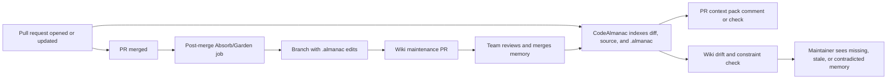

# Remote CodeAlmanac Product Concept

Date: 2026-05-28

## Product Sentence

CodeAlmanac Cloud is a GitHub-native maintainer for a repo-owned AI-agent wiki. It watches code change, surfaces the right project memory inside PRs, detects wiki drift, and opens reviewed PRs against `.almanac/` so future coding agents stop rediscovering or violating team knowledge.

The hosted service should compute, schedule, index, render, and notify. Git should remain the canonical store for durable engineering memory.

## First-Principles Position

Teams do not need another generic remote memory bucket. They need coding agents to inherit the same project constraints, decisions, workflows, and gotchas that experienced maintainers carry in their heads.

That need has four properties:

- It is shared. The memory must be visible to the team, not trapped in one user's chat history.
- It is governed. Important claims need diffs, review, ownership, and a way to revert.
- It is branch-aware. A fact can be true on one branch and false on another.
- It is operational. The memory should appear before and during coding work, not only in a separate knowledge portal.

GitHub already owns the review workflow. CodeAlmanac should attach memory maintenance to that workflow rather than invent a parallel source of truth.

## Core Product Loop

The loop should feel like a code review companion for project memory. It should not try to be the primary code reviewer. CodeRabbit, Greptile, PR-Agent, Claude Code Action, and OpenReview already compete there.

## Product Surfaces

### 1. PR Context Pack

On pull request open or update, CodeAlmanac finds `.almanac` pages relevant to the changed files and posts a compact context pack:

- affected wiki pages,
- constraints and gotchas that apply,
- prior decisions that might be violated,
- missing wiki coverage for changed subsystems,
- links to source-backed pages and exact page diffs.

This should be short by default. The goal is to prevent wrong turns, not decorate every PR.

### 2. Wiki Drift Check

The app runs an advisory check that asks:

- Did this PR change files mentioned by existing wiki pages?
- Do those pages now look stale or contradicted?
- Did the PR introduce a new subsystem, workflow, invariant, or integration that deserves wiki coverage?
- Did the PR discussion reveal a durable decision or rejected approach?

The first version should be advisory. Blocking merge on memory drift should be opt-in for mature teams only.

### 3. Post-Merge Wiki PR

After merge, CodeAlmanac runs an Absorb/Garden job with the merged diff, changed files, existing wiki pages, PR title/body, review comments, and commit messages. If there is a durable update, it opens a branch like `almanac/update-auth-session-boundary` and a PR that edits `.almanac/`.

The PR body should explain:

- what changed,
- which evidence was used,
- which pages were edited or created,
- what was intentionally not captured,
- what a human reviewer should verify.

### 4. Hosted Viewer And Queue

The hosted UI should render the repo wiki and remote jobs, but it should not become canonical. It should show:

- wiki graph and search,
- pages most often surfaced in PRs,
- stale pages and dead file references,
- open wiki PRs,
- skipped capture jobs and reasons,
- coverage by repo path and topic,
- unresolved questions extracted from reviews.

The UI is valuable because GitHub is bad at graph browsing and maintenance queues. Git remains valuable because GitHub is excellent at review and audit.

### 5. Agent Context API And MCP

Teams using Codex, Claude Code, Cursor, OpenHands, or custom agents should be able to request:

- `context_for_task(repo, branch, task, changed_files)`,
- `context_for_pr(repo, pr_number)`,
- `wiki_pages_for_files(repo, paths)`,
- `open_questions(repo, subsystem)`,
- `constraints_for_files(repo, paths)`.

The remote service can answer from the hosted index, but returned content should point back to `.almanac/` pages and commit SHAs. Agents should cite repo-owned memory, not opaque cloud memory.

### 6. Org Almanac

Some knowledge spans repositories: platform conventions, shared auth boundaries, API contracts, incident playbooks, deployment rules, and product strategy. The correct structure is a separate org-owned Almanac repository, not hosted-only memory.

An org almanac should be optional and explicit:

- repo `.almanac/` remains local project memory,
- org almanac stores cross-repo memory,
- cross-wiki links connect them,
- GitHub permissions decide who can read or edit each layer.

## Data Boundary

Canonical:

- `.almanac/pages/*.md`
- `.almanac/topics.yaml`
- committed wiki history
- wiki maintenance PRs
- optional org almanac repository

Hosted:

- branch indexes,
- embeddings if later justified,
- job logs,
- event cursors,
- GitHub installation metadata,
- stale-page reports,
- rendered graph cache,
- notification preferences,
- temporary evidence bundles for pending wiki PRs.

Never canonical:

- raw conversation transcripts,
- private chat memory,
- embeddings,
- model summaries that have not landed in Git,
- hidden "learnings" that influence agents without a reviewed page.

This boundary is the trust story.

## GitHub Permissions

The default GitHub App likely needs:

- metadata read,
- contents read/write for `.almanac/` branches,
- pull requests read/write for context comments, reviews, and wiki PRs,
- issues read/write if issue comments can trigger maintenance,
- checks write for drift status,
- commit statuses write if using statuses instead of checks.

Enterprise mode should support:

- selected-repository installation,
- path-limited write behavior by policy, even if GitHub permission is broader,
- no code retention after job completion,
- customer model provider or VPC/self-hosted worker,
- audit log export,
- SSO/SAML at the hosted UI layer.

## Packaging

Offer three installation paths:

| Path | Buyer | Purpose |
| --- | --- | --- |
| Local CLI | Individual developers and open source | Create and maintain `.almanac/` without cloud dependency. |
| GitHub App | Teams | PR context, drift checks, post-merge wiki PRs, hosted viewer, shared queue. |
| GitHub Action or self-hosted worker | Regulated teams | Run maintenance in customer infrastructure while preserving the same Git contract. |

The GitHub App should be the default paid product. The Action should be a trust-minimal fallback, not the main onboarding story.

## MVP

The smallest compelling remote product is:

1. Install GitHub App on a selected repository.
2. Index `.almanac/` and source references on default branch.
3. On PR open/update, post one compact context comment that links relevant pages and missing coverage.
4. After merge, run capture and open a wiki PR only when there is a concrete durable update.
5. Provide a hosted queue showing PRs reviewed, pages affected, skipped captures, and open wiki PRs.

Do not build generic chat, broad semantic search, or a large dashboard first. The first "wow" moment should be a PR where the app says: "This change touches the checkout timeout behavior; here are the two previous decisions and the dead page that needs updating," then opens the exact wiki PR after merge.

## Differentiation

| Product category | Their center | CodeAlmanac's center |
| --- | --- | --- |
| CodeRabbit | Automated PR code review and learned review preferences. | Persistent project memory maintained through Git. |
| Greptile | Codebase-aware PR review using indexed graph context. | Wiki drift and agent context from reviewed memory. |
| PR-Agent/OpenReview/Claude Code Action | PR agent actions: review, ask, fix, run tools. | Memory maintenance before and after those agents work. |
| DeepWiki/CodeWiki | Generated repo understanding and architecture docs. | Durable decisions, constraints, workflows, gotchas, and maintenance history. |
| Supermemory/Hyper | Hosted recall across conversations and sources. | Repo-owned, branch-aware, reviewable team truth. |
| aictx/memory/Cline Memory Bank | Local memory conventions for agents. | Team automation around GitHub events, PR checks, and wiki maintenance PRs. |

The clean positioning:

> CodeRabbit reviews the code. Greptile understands the code. CodeAlmanac keeps the project memory true.

## Pricing Hypothesis

Free/open source:

- local CLI,
- local wiki validation/search,
- manual capture,
- basic GitHub Action recipe.

Team:

- GitHub App,
- PR context pack,
- drift checks,
- post-merge wiki PRs,
- hosted queue and viewer,
- team notification controls,
- limited retention.

Enterprise:

- self-hosted or VPC workers,
- customer model routing,
- org almanac,
- audit logs,
- SSO/SAML,
- retention controls,
- policy controls for blocking checks and CODEOWNERS routing.

Pricing should be by active repository or active developer, not by memory volume. The value is fewer repeated mistakes and faster agent onboarding, not storage.

## Metrics

Activation:

- percentage of PRs where the context pack is expanded or clicked,
- first accepted wiki PR,
- number of maintainers reviewing wiki PRs.

Quality:

- wiki PR acceptance rate,
- percentage of generated wiki PRs closed without merge,
- human edits per wiki PR,
- false-positive drift reports,
- repeated warning suppression rate.

Outcome:

- time from subsystem change to wiki update,
- number of PRs with stale-page warnings over time,
- agent sessions that loaded remote context before edits,
- repeated bug or rejected-approach recurrence rate where measurable.

Trust:

- code retention setting adoption,
- self-hosted worker adoption,
- permission downgrade requests,
- audit log usage.

## Risks

Noise is the biggest product risk. A noisy app becomes another ignored bot. Default to one compact PR comment, advisory checks, and no wiki PR unless evidence is strong.

Security review is the biggest sales risk. Private-code access requires fine-grained GitHub permissions, clear retention defaults, and a self-hosted path.

Split-brain memory is the biggest architectural risk. Never make hosted memory canonical. Every durable claim should be reviewable in Git.

Commodity review is the biggest positioning risk. Avoid competing directly on general PR review. The review market is crowded and model quality will compress differentiation.

Over-generation is the biggest content risk. A beautiful generated wiki that no one trusts is worse than a small wiki that agents actually use. Optimize for concise pages with provenance and maintenance history.

## Product Decisions

- Build GitHub App first for the paid remote workflow.
- Keep `.almanac/` canonical.
- Treat hosted state as cache, index, queue, and viewer.
- Make PR context and wiki drift the initial remote wedge.
- Make post-merge wiki PRs the maintenance mechanism.
- Offer GitHub Action/self-hosted worker for trust-sensitive teams.
- Do not build a hosted-only wiki editor as the primary path.
- Do not build generic conversation memory as the primary path.
- Do not compete head-on with code-review bots.

## Should The Remote Product Exist?

Yes, if it is a GitHub maintenance layer. No, if it is only hosted memory.

The remote product earns its right to exist when it does work a local CLI cannot do reliably for a team: watch every PR, compare changed code to reviewed wiki pages, coordinate post-merge updates, route wiki PRs through maintainers, show stale coverage across repositories, and give every coding agent the same branch-aware context. That is team infrastructure.

The remote product does not earn its right to exist by storing extracted memories from chats in a private cloud database. That is useful in a different product category, but it weakens CodeAlmanac's main trust claim. The durable memory should be boring, visible Markdown in Git; the remote system should make that boring artifact impossible to neglect.

## Next Build Spec

The first engineering plan should define:

- GitHub App event subscriptions and permissions.
- Repository installation and indexing lifecycle.
- Branch-aware `.almanac` index storage.
- PR context-pack selection algorithm.
- Drift check prompt and evidence contract.
- Post-merge capture worker contract.
- Wiki PR branch naming, commit message, and PR template.
- Hosted queue schema and minimal UI.
- Retention and deletion policy.
- Self-hosted worker boundary.

That plan should explicitly preserve the local-only CLI contract: remote features add collaboration and automation, but local CodeAlmanac remains useful without the hosted service.
